# AWS Multi-Region DevOps Architecture
## Logicworks Company - Enterprise IT Project

---

## Architecture Overview

This architecture demonstrates a comprehensive AWS multi-region setup for high availability, disaster recovery, and automated CI/CD pipeline management.

```mermaid
flowchart TB
    %% Global Services
    subgraph global["🌐 Global Services"]
        route53["🌍 Route 53<br/>DNS & Health Checks"]
        iam["🔐 IAM<br/>Identity & Access"]
        cloudfront["⚡ CloudFront<br/>CDN"]
    end
    
    %% Primary Region
    subgraph region1["🌟 Primary Region (us-east-1)"]
        subgraph vpc1["🏠 VPC Primary (10.0.0.0/16)"]
            subgraph pub1["🌐 Public Subnet"]
                igw1["🚪 Internet Gateway"]
                alb1["⚖️ Application Load Balancer"]
                nat1["🔄 NAT Gateway"]
            end
            
            subgraph priv1["🔒 Private Subnet"]
                ecs1["🐳 ECS Cluster<br/>Auto Scaling"]
                rds1["🗄️ RDS PostgreSQL<br/>Multi-AZ Primary"]
            end
        end
        
        subgraph services1["🛠️ AWS Services"]
            ecr1["📦 ECR Repository<br/>Container Images"]
            codecommit1["💾 CodeCommit<br/>Source Control"]
            codebuild1["🏗️ CodeBuild<br/>Build Automation"]
            codepipeline1["🔄 CodePipeline<br/>CI/CD Orchestration"]
            s3artifacts1["📁 S3 Artifacts<br/>Build Outputs"]
            cloudwatch1["📊 CloudWatch<br/>Monitoring"]
            sns1["📢 SNS<br/>Notifications"]
        end
    end
    
    %% Secondary Region
    subgraph region2["🌟 Secondary Region (us-west-2)"]
        subgraph vpc2["🏠 VPC Secondary (10.1.0.0/16)"]
            subgraph pub2["🌐 Public Subnet"]
                igw2["🚪 Internet Gateway"]
                alb2["⚖️ Application Load Balancer"]
                nat2["🔄 NAT Gateway"]
            end
            
            subgraph priv2["🔒 Private Subnet"]
                ecs2["🐳 ECS Cluster<br/>Auto Scaling"]
                rds2["🗄️ RDS PostgreSQL<br/>Read Replica"]
            end
        end
        
        subgraph services2["🛠️ AWS Services"]
            ecr2["📦 ECR Repository<br/>Replicated Images"]
            codecommit2["💾 CodeCommit<br/>Replica Repository"]
            codebuild2["🏗️ CodeBuild<br/>Build Automation"]
            codepipeline2["🔄 CodePipeline<br/>CI/CD Orchestration"]
            s3artifacts2["📁 S3 Artifacts<br/>Cross-Region Sync"]
            cloudwatch2["📊 CloudWatch<br/>Monitoring"]
            sns2["📢 SNS<br/>Notifications"]
        end
    end
    
    %% Manual Approval
    subgraph approval["👥 Approval Process"]
        manual["✋ Manual Approval Gate<br/>Production Deployment"]
        stakeholders["👨‍💼 Stakeholders<br/>DevOps Team"]
    end
    
    %% User Traffic Flow
    users["👥 End Users"] --> route53
    route53 --> cloudfront
    cloudfront --> alb1
    cloudfront --> alb2
    
    %% Network Connectivity
    igw1 --> alb1
    igw2 --> alb2
    alb1 --> ecs1
    alb2 --> ecs2
    
    %% VPC Peering
    vpc1 -.->|"🔗 VPC Peering"| vpc2
    
    %% Database Replication
    rds1 -.->|"📋 Cross-Region Replication"| rds2
    
    %% Container Registry Replication
    ecr1 -.->|"📦 Image Replication"| ecr2
    
    %% Source Code Replication
    codecommit1 -.->|"💾 Code Sync"| codecommit2
    
    %% Artifact Replication
    s3artifacts1 -.->|"📁 Cross-Region Sync"| s3artifacts2
    
    %% Primary CI/CD Flow
    codecommit1 --> codepipeline1
    codepipeline1 --> codebuild1
    codebuild1 --> ecr1
    codebuild1 --> s3artifacts1
    codepipeline1 --> manual
    manual --> ecs1
    manual --> ecs2
    
    %% Secondary CI/CD Flow
    codecommit2 --> codepipeline2
    codepipeline2 --> codebuild2
    codebuild2 --> ecr2
    codebuild2 --> s3artifacts2
    
    %% Container Deployments
    ecr1 --> ecs1
    ecr2 --> ecs2
    
    %% Database Connections
    ecs1 --> rds1
    ecs2 --> rds2
    
    %% Monitoring & Alerting
    ecs1 --> cloudwatch1
    ecs2 --> cloudwatch2
    rds1 --> cloudwatch1
    rds2 --> cloudwatch2
    cloudwatch1 --> sns1
    cloudwatch2 --> sns2
    sns1 --> stakeholders
    sns2 --> stakeholders
    
    %% Approval Notifications
    manual --> sns1
    manual --> sns2
    
    %% Styling
    classDef primaryRegion fill:#e1f5fe,stroke:#01579b,stroke-width:2px
    classDef secondaryRegion fill:#f3e5f5,stroke:#4a148c,stroke-width:2px
    classDef globalServices fill:#e8f5e8,stroke:#1b5e20,stroke-width:2px
    classDef approvalProcess fill:#fff3e0,stroke:#e65100,stroke-width:2px
    classDef userTraffic fill:#fce4ec,stroke:#880e4f,stroke-width:2px
    
    class region1,vpc1,services1 primaryRegion
    class region2,vpc2,services2 secondaryRegion
    class global globalServices
    class approval,manual,stakeholders approvalProcess
    class users userTraffic
```



---

## Project Requirements Analysis

### 1. Infrastructure as Code (IaC)
**Requirement**: Facilitate faster replication of environments for different customers
**Solution**: 
- **Terraform** for infrastructure provisioning
- **Modular design** with reusable modules
- **Environment-specific configurations** (dev, staging, prod)
- **Version control** for infrastructure changes

### 2. Multi-Region Architecture
**Requirement**: High Availability and Disaster Recovery across two regions
**Solution**:
- **Primary Region**: us-east-1
- **Secondary Region**: us-west-2
- **VPC Peering** for secure communication
- **Route 53** for DNS failover
- **RDS Cross-Region Replication**

### 3. Container Management
**Requirement**: Run applications in containers with image storage and orchestration
**Solution**:
- **Amazon ECS** for container orchestration
- **Amazon ECR** for Docker image repository
- **Application Load Balancer** for traffic distribution
- **Auto Scaling** for container growth management

### 4. Automated CI/CD Pipeline
**Requirement**: Automate pipeline with source, build, stage, manual approval, and production
**Solution**:
- **AWS CodePipeline** for orchestration
- **AWS CodeCommit** for source control
- **AWS CodeBuild** for build automation
- **Manual approval** gates before production
- **Stage-wise deployment** process

### 5. Cross-Region Code Replication
**Requirement**: Source code repository replication to avoid latency
**Solution**:
- **CodeCommit replication** across regions
- **Local code pulls** within each region
- **Synchronized repositories** with automated sync

### 6. Continuous Monitoring
**Requirement**: Monitor infrastructure and applications with notifications
**Solution**:
- **Amazon CloudWatch** for metrics and logs
- **Amazon SNS** for notifications
- **Custom dashboards** for visibility
- **Alerting rules** for proactive monitoring

### 7. Approved CI/CD Pipeline
**Requirement**: Manual approval before production deployment
**Solution**:
- **Manual approval actions** in CodePipeline
- **Stage gates** with approval workflows
- **Role-based access control** for approvals
- **Audit trails** for compliance

---

## Implementation Steps

### Phase 1: Foundation Setup (Week 1)

#### Step 1: AWS Account Preparation
```bash
# Configure AWS CLI for both regions
aws configure set region us-east-1
aws configure set output json

# Create IAM roles and policies
aws iam create-role --role-name DevOps-ExecutionRole
aws iam create-role --role-name CodePipeline-ServiceRole
aws iam create-role --role-name ECS-TaskExecutionRole
```

#### Step 2: Terraform Project Structure
```
terraform/
├── modules/
│   ├── vpc/
│   ├── ecs/
│   ├── rds/
│   ├── cicd/
│   └── monitoring/
├── environments/
│   ├── dev/
│   ├── staging/
│   └── prod/
└── global/
    ├── iam/
    └── route53/
```

### Phase 2: Network Infrastructure (Week 2)

#### Step 3: VPC and Networking Setup
```hcl
# terraform/modules/vpc/main.tf
module "vpc_primary" {
  source = "./modules/vpc"
  
  vpc_cidr             = "10.0.0.0/16"
  availability_zones   = ["us-east-1a", "us-east-1b"]
  private_subnet_cidrs = ["10.0.1.0/24", "10.0.2.0/24"]
  public_subnet_cidrs  = ["10.0.101.0/24", "10.0.102.0/24"]
  
  tags = {
    Environment = "production"
    Region      = "primary"
  }
}
```

#### Step 4: Cross-Region Connectivity
```hcl
# VPC Peering Connection
resource "aws_vpc_peering_connection" "main" {
  vpc_id        = module.vpc_primary.vpc_id
  peer_vpc_id   = module.vpc_secondary.vpc_id
  peer_region   = "us-west-2"
  auto_accept   = false
}
```

### Phase 3: Container Platform (Week 3)

#### Step 5: ECS Cluster Setup
```hcl
# terraform/modules/ecs/main.tf
resource "aws_ecs_cluster" "main" {
  name = "${var.environment}-ecs-cluster"
  
  setting {
    name  = "containerInsights"
    value = "enabled"
  }
}

resource "aws_ecs_service" "app" {
  name            = "${var.environment}-app-service"
  cluster         = aws_ecs_cluster.main.id
  task_definition = aws_ecs_task_definition.app.arn
  desired_count   = 2
  
  deployment_configuration {
    maximum_percent         = 200
    minimum_healthy_percent = 100
  }
  
  load_balancer {
    target_group_arn = aws_lb_target_group.app.arn
    container_name   = "app"
    container_port   = 8080
  }
}
```

#### Step 6: ECR Repository Setup
```bash
# Create ECR repositories in both regions
aws ecr create-repository --repository-name my-app --region us-east-1
aws ecr create-repository --repository-name my-app --region us-west-2

# Set up cross-region replication
aws ecr put-replication-configuration \
  --replication-configuration file://ecr-replication.json
```

### Phase 4: CI/CD Pipeline (Week 4)

#### Step 7: CodeCommit and CodePipeline Setup
```yaml
# buildspec.yml
version: 0.2

phases:
  pre_build:
    commands:
      - echo Logging in to Amazon ECR...
      - aws ecr get-login-password --region $AWS_DEFAULT_REGION | docker login --username AWS --password-stdin $AWS_ACCOUNT_ID.dkr.ecr.$AWS_DEFAULT_REGION.amazonaws.com
  build:
    commands:
      - echo Build started on `date`
      - echo Building the Docker image...
      - docker build -t $IMAGE_REPO_NAME:$IMAGE_TAG .
      - docker tag $IMAGE_REPO_NAME:$IMAGE_TAG $AWS_ACCOUNT_ID.dkr.ecr.$AWS_DEFAULT_REGION.amazonaws.com/$IMAGE_REPO_NAME:$IMAGE_TAG
  post_build:
    commands:
      - echo Build completed on `date`
      - echo Pushing the Docker image...
      - docker push $AWS_ACCOUNT_ID.dkr.ecr.$AWS_DEFAULT_REGION.amazonaws.com/$IMAGE_REPO_NAME:$IMAGE_TAG
```

#### Step 8: Pipeline Configuration
```hcl
# terraform/modules/cicd/pipeline.tf
resource "aws_codepipeline" "main" {
  name     = "${var.environment}-pipeline"
  role_arn = aws_iam_role.codepipeline.arn

  artifact_store {
    location = aws_s3_bucket.artifacts.bucket
    type     = "S3"
    region   = "us-east-1"
  }

  artifact_store {
    location = aws_s3_bucket.artifacts_west.bucket
    type     = "S3"
    region   = "us-west-2"
  }

  stage {
    name = "Source"
    action {
      name             = "Source"
      category         = "Source"
      owner            = "AWS"
      provider         = "CodeCommit"
      version          = "1"
      output_artifacts = ["source_output"]
      
      configuration = {
        RepositoryName = aws_codecommit_repository.main.repository_name
        BranchName     = "main"
      }
    }
  }

  stage {
    name = "Build"
    action {
      name             = "Build"
      category         = "Build"
      owner            = "AWS"
      provider         = "CodeBuild"
      input_artifacts  = ["source_output"]
      output_artifacts = ["build_output"]
      version          = "1"
      
      configuration = {
        ProjectName = aws_codebuild_project.main.name
      }
    }
  }

  stage {
    name = "Deploy_to_Staging"
    action {
      name            = "Deploy"
      category        = "Deploy"
      owner           = "AWS"
      provider        = "ECS"
      input_artifacts = ["build_output"]
      version         = "1"
      region          = "us-east-1"
      
      configuration = {
        ClusterName = aws_ecs_cluster.staging.name
        ServiceName = aws_ecs_service.staging.name
        FileName    = "imagedefinitions.json"
      }
    }
  }

  stage {
    name = "Manual_Approval"
    action {
      name     = "Approval"
      category = "Approval"
      owner    = "AWS"
      provider = "Manual"
      version  = "1"
      
      configuration = {
        NotificationArn = aws_sns_topic.approvals.arn
        CustomData      = "Please review the staging deployment and approve for production."
      }
    }
  }

  stage {
    name = "Deploy_to_Production"
    action {
      name            = "Deploy_Primary"
      category        = "Deploy"
      owner           = "AWS"
      provider        = "ECS"
      input_artifacts = ["build_output"]
      version         = "1"
      region          = "us-east-1"
      
      configuration = {
        ClusterName = aws_ecs_cluster.primary.name
        ServiceName = aws_ecs_service.primary.name
        FileName    = "imagedefinitions.json"
      }
    }
    
    action {
      name            = "Deploy_Secondary"
      category        = "Deploy"
      owner           = "AWS"
      provider        = "ECS"
      input_artifacts = ["build_output"]
      version         = "1"
      region          = "us-west-2"
      
      configuration = {
        ClusterName = aws_ecs_cluster.secondary.name
        ServiceName = aws_ecs_service.secondary.name
        FileName    = "imagedefinitions.json"
      }
    }
  }
}
```

### Phase 5: Database Setup (Week 5)

#### Step 9: RDS Multi-Region Setup
```hcl
# Primary RDS Instance
resource "aws_db_instance" "primary" {
  identifier     = "${var.environment}-primary-db"
  engine         = "postgres"
  engine_version = "13.7"
  instance_class = "db.t3.medium"
  
  allocated_storage     = 20
  max_allocated_storage = 100
  storage_encrypted     = true
  
  db_name  = var.db_name
  username = var.db_username
  password = var.db_password
  
  backup_retention_period = 7
  backup_window          = "03:00-04:00"
  maintenance_window     = "Sun:04:00-Sun:05:00"
  
  vpc_security_group_ids = [aws_security_group.rds.id]
  db_subnet_group_name   = aws_db_subnet_group.main.name
  
  # Enable automated backups for read replica
  backup_retention_period = 7
  
  tags = {
    Name = "${var.environment}-primary-db"
  }
}

# Read Replica in Secondary Region
resource "aws_db_instance" "replica" {
  provider = aws.west
  
  identifier                = "${var.environment}-replica-db"
  replicate_source_db       = aws_db_instance.primary.identifier
  instance_class            = "db.t3.medium"
  
  vpc_security_group_ids = [aws_security_group.rds_west.id]
  
  tags = {
    Name = "${var.environment}-replica-db"
  }
}
```

### Phase 6: Monitoring and Alerting (Week 6)

#### Step 10: CloudWatch Setup
```hcl
# CloudWatch Dashboard
resource "aws_cloudwatch_dashboard" "main" {
  dashboard_name = "${var.environment}-dashboard"

  dashboard_body = jsonencode({
    widgets = [
      {
        type   = "metric"
        x      = 0
        y      = 0
        width  = 12
        height = 6

        properties = {
          metrics = [
            ["AWS/ECS", "CPUUtilization", "ServiceName", aws_ecs_service.app.name],
            [".", "MemoryUtilization", ".", "."],
          ]
          view    = "timeSeries"
          stacked = false
          region  = var.aws_region
          title   = "ECS Service Metrics"
          period  = 300
        }
      }
    ]
  })
}

# CloudWatch Alarms
resource "aws_cloudwatch_metric_alarm" "high_cpu" {
  alarm_name          = "${var.environment}-high-cpu"
  comparison_operator = "GreaterThanThreshold"
  evaluation_periods  = "2"
  metric_name         = "CPUUtilization"
  namespace           = "AWS/ECS"
  period              = "120"
  statistic           = "Average"
  threshold           = "80"
  alarm_description   = "This metric monitors ECS CPU utilization"
  alarm_actions       = [aws_sns_topic.alerts.arn]

  dimensions = {
    ServiceName = aws_ecs_service.app.name
    ClusterName = aws_ecs_cluster.main.name
  }
}
```

#### Step 11: SNS Notifications
```hcl
# SNS Topics for Alerts
resource "aws_sns_topic" "alerts" {
  name = "${var.environment}-alerts"
}

resource "aws_sns_topic_subscription" "email_alerts" {
  topic_arn = aws_sns_topic.alerts.arn
  protocol  = "email"
  endpoint  = var.alert_email
}

# SNS Topic for Pipeline Approvals
resource "aws_sns_topic" "approvals" {
  name = "${var.environment}-approvals"
}

resource "aws_sns_topic_subscription" "approval_email" {
  topic_arn = aws_sns_topic.approvals.arn
  protocol  = "email"
  endpoint  = var.approval_email
}
```

---

## Security Considerations

### IAM Roles and Policies
```json
{
  "Version": "2012-10-17",
  "Statement": [
    {
      "Effect": "Allow",
      "Principal": {
        "Service": "ecs-tasks.amazonaws.com"
      },
      "Action": "sts:AssumeRole"
    }
  ]
}
```

### Security Groups
```hcl
# Application Load Balancer Security Group
resource "aws_security_group" "alb" {
  name_prefix = "${var.environment}-alb-"
  vpc_id      = var.vpc_id

  ingress {
    from_port   = 80
    to_port     = 80
    protocol    = "tcp"
    cidr_blocks = ["0.0.0.0/0"]
  }

  ingress {
    from_port   = 443
    to_port     = 443
    protocol    = "tcp"
    cidr_blocks = ["0.0.0.0/0"]
  }

  egress {
    from_port   = 0
    to_port     = 0
    protocol    = "-1"
    cidr_blocks = ["0.0.0.0/0"]
  }
}
```

---

## Deployment Commands

### Initial Infrastructure Deployment
```bash
# Initialize Terraform
cd terraform/environments/prod
terraform init

# Plan the deployment
terraform plan -out=tfplan

# Apply the infrastructure
terraform apply tfplan
```

### Application Deployment
```bash
# Build and push initial image
docker build -t my-app:latest .
aws ecr get-login-password --region us-east-1 | docker login --username AWS --password-stdin 123456789012.dkr.ecr.us-east-1.amazonaws.com
docker tag my-app:latest 123456789012.dkr.ecr.us-east-1.amazonaws.com/my-app:latest
docker push 123456789012.dkr.ecr.us-east-1.amazonaws.com/my-app:latest

# Trigger pipeline
git add .
git commit -m "Initial application deployment"
git push origin main
```

---

## Cost Optimization

### Estimated Monthly Costs (USD)
- **ECS Fargate**: ~$150-300
- **Application Load Balancer**: ~$20
- **RDS (Multi-AZ)**: ~$100-200
- **ECR Storage**: ~$10-20
- **VPC NAT Gateway**: ~$45 per gateway
- **CodePipeline**: ~$1 per pipeline
- **CloudWatch**: ~$10-30
- **Data Transfer**: ~$50-100

**Total Estimated**: $400-800/month

### Cost Optimization Strategies
1. Use **Reserved Instances** for predictable workloads
2. Implement **Auto Scaling** to optimize resource usage
3. Use **Spot Instances** for non-critical workloads
4. Optimize **ECR image sizes**
5. Set up **Cost Budgets** and alerts

---

## Troubleshooting Guide

### Common Issues and Solutions

#### Pipeline Failures
```bash
# Check CodeBuild logs
aws logs describe-log-groups --log-group-name-prefix /aws/codebuild

# Check pipeline execution
aws codepipeline get-pipeline-state --name my-pipeline
```

#### ECS Service Issues
```bash
# Check service events
aws ecs describe-services --cluster my-cluster --services my-service

# Check task logs
aws logs get-log-events --log-group-name /ecs/my-app
```

#### Network Connectivity
```bash
# Test VPC peering
aws ec2 describe-vpc-peering-connections

# Check route tables
aws ec2 describe-route-tables --filters "Name=vpc-id,Values=vpc-12345"
```

---

## Next Steps and Enhancements

### Phase 7: Advanced Features
1. **Service Mesh** integration with AWS App Mesh
2. **Secrets Management** with AWS Secrets Manager
3. **Container Security** scanning with ECR
4. **Blue/Green Deployments** with CodeDeploy
5. **Infrastructure Testing** with Terratest

### Phase 8: Optimization
1. **Cost optimization** with AWS Cost Explorer
2. **Performance tuning** with X-Ray tracing
3. **Security hardening** with AWS Config
4. **Compliance** with AWS Systems Manager

This architecture provides a robust, scalable, and secure foundation for your AWS DevOps environment that meets all the specified requirements while following AWS best practices.