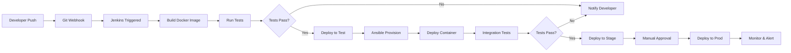

# AppleBite Co. - CI/CD DevOps Project

> **🚀 NEW TO THIS PROJECT? Start with [START_HERE.md](START_HERE.md) for quick
> setup!**

## Project Overview

This project implements a complete **Continuous Integration and Continuous
Deployment (CI/CD)** pipeline for AppleBite Co.'s PHP application using modern
DevOps tools and practices.

### Business Challenge

AppleBite Co. needs to:
- Deliver product updates frequently to production with high quality &
  reliability
- Accelerate software delivery speed and reduce feedback time between developers
  and testers
- Manage complex builds and incremental deployments efficiently
- Automate deployment from development to staging to production

### Solution Architecture

Automated CI/CD pipeline that:
1. **Detects** code changes when developers push to Git master branch
2. **Provisions** a new test server with all required software using Ansible
3. **Containerizes** the application using Docker
4. **Deploys** to test/stage environment for validation
5. **Promotes** to production automatically after successful testing

### Technologies Used

| Tool | Purpose |
|------|---------|
| **Git** | Version control for tracking code changes |
| **Jenkins** | CI/CD automation and orchestration |
| **Docker** | Application containerization |
| **Ansible** | Configuration management and provisioning |
| **PHP/Apache** | Application runtime |

## Project Structure

```
AppleBite_CICD_Project/
├── README.md                          # This file
├── SETUP_GUIDE.md                     # Complete setup instructions
├── DEPLOYMENT_GUIDE.md                # Deployment procedures
├── app/                               # PHP Application code
│   └── (cloned from projCert repo)
├── docker/
│   ├── Dockerfile                     # Container definition
│   ├── docker-compose.test.yml        # Test environment
│   ├── docker-compose.stage.yml       # Stage environment
│   └── docker-compose.prod.yml        # Production environment
├── ansible/
│   ├── inventory/                     # Server inventory files
│   │   ├── test.ini
│   │   ├── stage.ini
│   │   └── prod.ini
│   ├── playbooks/
│   │   ├── provision-server.yml       # Server provisioning
│   │   ├── deploy-app.yml             # Application deployment
│   │   └── rollback.yml               # Rollback procedure
│   └── roles/                         # Ansible roles
│       ├── common/
│       ├── docker/
│       └── app/
├── jenkins/
│   ├── Jenkinsfile                    # Main pipeline
│   ├── Jenkinsfile.test               # Test pipeline
│   └── jenkins-setup.sh               # Jenkins installation script
├── scripts/
│   ├── setup.sh                       # Initial setup script
│   ├── build.sh                       # Build automation
│   ├── deploy.sh                      # Deployment script
│   ├── test.sh                        # Testing script
│   └── cleanup.sh                     # Cleanup script
└── tests/
    ├── unit/                          # Unit tests
    └── integration/                   # Integration tests
```

## Quick Start

### Prerequisites

- Windows 10/11 with WSL2 or Linux/macOS
- Git installed
- Docker Desktop installed
- Jenkins installed (or use provided script)
- Ansible installed (or use provided script)
- Basic understanding of CI/CD concepts

### 1. Clone This Project

```bash
cd c:/Users/hardi/HARDIK/Learn/Edureka_DevOps_Arch_Training/AWS_Projects/AppleBite_CICD_Project
```

### 2. Run Initial Setup

```bash
chmod +x scripts/setup.sh
./scripts/setup.sh
```

This will:
- Clone the PHP application from GitHub
- Install required dependencies
- Set up Docker environment
- Configure Ansible
- Prepare Jenkins

### 3. Configure Jenkins

```bash
chmod +x jenkins/jenkins-setup.sh
./jenkins/jenkins-setup.sh
```

### 4. Deploy to Test Environment

```bash
chmod +x scripts/deploy.sh
./scripts/deploy.sh test
```

### 5. Access the Application

- **Test Environment**: http://localhost:8080
- **Stage Environment**: http://localhost:8081
- **Production Environment**: http://localhost:8082

## Pipeline Workflow



## Key Features

### ✅ Automated CI/CD Pipeline
- Automatic trigger on Git push
- Multi-stage deployment (Test → Stage → Prod)
- Automated testing at each stage

### ✅ Infrastructure as Code
- Ansible playbooks for server provisioning
- Dockerfiles for consistent environments
- Jenkins pipeline as code

### ✅ Containerization
- Docker containers for application isolation
- Docker Compose for multi-container orchestration
- Easy scaling and rollback

### ✅ Configuration Management
- Ansible roles for server configuration
- Environment-specific configurations
- Idempotent deployments

### ✅ Quality Assurance
- Automated testing in pipeline
- Code quality checks
- Rollback capabilities

## Environment Configuration

### Test Environment
- Purpose: Automated testing and validation
- Deployment: Automatic on every commit
- Port: 8080

### Stage Environment
- Purpose: Pre-production validation
- Deployment: Automatic after test passes
- Port: 8081

### Production Environment
- Purpose: Live application
- Deployment: Manual approval required
- Port: 8082

## Security Considerations

- Secrets managed via Jenkins credentials
- Docker images scanned for vulnerabilities
- Ansible vault for sensitive data
- Non-root Docker containers
- Network isolation between environments

## Monitoring & Logging

- Jenkins build logs
- Docker container logs
- Application logs
- Health check endpoints
- Email/Slack notifications

## Troubleshooting

See [SETUP_GUIDE.md](SETUP_GUIDE.md) for detailed troubleshooting steps.

### Common Issues

1. **Docker daemon not running**: Start Docker Desktop
2. **Port already in use**: Change port in docker-compose files
3. **Ansible connection failed**: Check SSH keys and inventory
4. **Jenkins build failed**: Check console output and logs

## Documentation

- [SETUP_GUIDE.md](SETUP_GUIDE.md) - Complete setup instructions
- [DEPLOYMENT_GUIDE.md](DEPLOYMENT_GUIDE.md) - Deployment procedures
- [ARCHITECTURE.md](ARCHITECTURE.md) - Architecture details

## Contributing

1. Create feature branch
2. Make changes
3. Run tests locally
4. Submit pull request
5. Wait for CI/CD validation

## License

This is an educational project for AppleBite Co.

## Support

For issues and questions:
- Check documentation
- Review Jenkins logs
- Contact DevOps team


**Project Status**: ✅ Ready for Implementation

**Last Updated**: December 11, 2025
